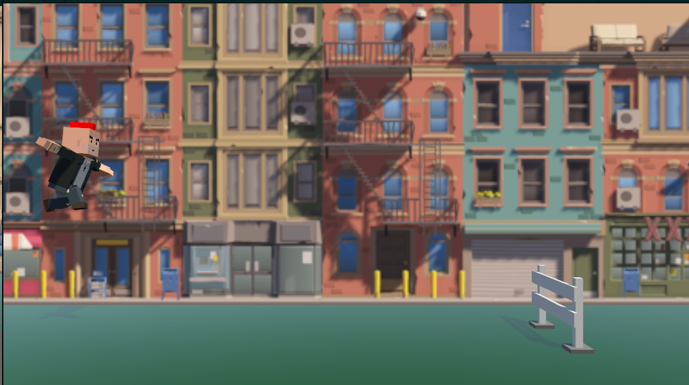
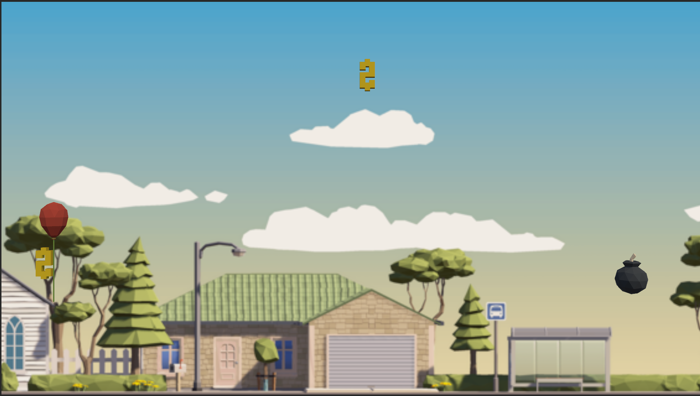

# Runner Game Project & Floating Balloon Game(Floating Balloon project is a challenge project, which means it's not the focus of this project)

## Runner Game

Runner Game is a minimalist game where players control a runner using only the space bar. The game features a side-view camera angle, and the objective is to jump over incoming obstacles by pressing the space bar.
In Runner Game, where the player aims to survive as long as possible. The immersive techno music and minimalist design create an engaging and enjoyable gaming experience.

### Controls
- Space: Make the player jump.

### Player
- Automatically runs forward.
- Jumps when the space bar is pressed.

### Obstacles
- Appear from the front.
- Player must jump over them using the space bar.

### Game Progression
- Obstacles continuously appear from the front.
- The player's goal is to jump over as many obstacles as possible.
- If the player collides with an obstacle, the game ends.

### Graphics and Sounds
- Minimalist and sleek design.
- Jumping produces a beep sound.
- Colliding with an obstacle generates smoke particles.
- Continuous techno music playing in the background.

### Visual Elements
- Simple visuals for the player, obstacles, and background.

### Target Audience
- Casual gamers who enjoy quick and challenging gameplay.

### Screenshot

## Floating Balloon
Floating Balloon is a game where players control a balloon that rises slightly each time the space bar is pressed. The game features a side-view camera angle, and the objective is to navigate through money and bomb objects.

## Game Mechanics
### Controls
- Space: Make the balloon rise.

### Balloon
- Ascends slightly with each press of the space bar.
- Descends gradually when not pressing space.

### Objects
- Money: Collecting awards points and makes a score sound.
- Bomb: Collision results in an explosion sound, a graphical explosion effect, and ends the game.

### Game Progression
- Objects continuously appear from the front.
- Players aim to collect as much money as possible.
- Colliding with a bomb ends the game.

### Graphics and Sounds
- Cheerful and colorful design.
- Rising produces a balloon inflating sound.
- Money collection triggers a cash register sound.
- Bomb collision produces an explosion sound and graphical effect.

### Scoring
- Points earned for each money collected.

### Visual Elements
- Whimsical visuals for the balloon, money, and bomb objects.

### ScreenShot

